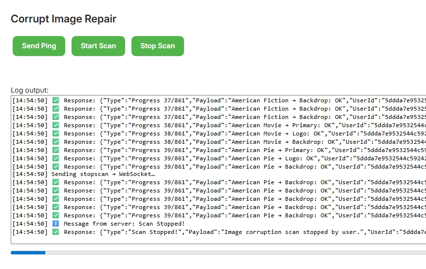

# Corrupt Image Repair (Demo Teaching Plugin)

This Emby plugin demonstrates how to perform a **non-destructive image corruption scan** using WebSockets for real-time progress updates.  
It was adapted from the `GameSocketDemo` scaffold and extended to scan library images (Primary, Backdrop, Logo, Thumb, etc.) without deleting or altering them.

---

## ✨ Features
- ✅ Real-time WebSocket communication (progress + status updates)
- ✅ Dummy (non-destructive) scan mode – images are checked but never modified
- ✅ Progress bar + log output UI in Emby Dashboard
- ✅ Buttons to `Ping`, `Start Scan`, and `Stop Scan`
- ✅ Teaching scaffold for learning Emby plugin development with WebSockets

---

## 📸 Screenshot

Here’s what the plugin looks like inside the Emby Dashboard:

---

## 📂 Project Structure
CorruptImageRepair/
├── Controllers/
│ └── ImageRepairController.cs
├── Services/
│ └── ImageRepairScanService.cs
├── Dashboard/
│ ├── corruptionrepair.html
│ └── corruptionrepair.js
├── ImageFunctions.cs
├── WebSocket.cs
└── Plugin.cs

yaml
Copy code

---

## 🚀 How to Build
1. Open solution in **Visual Studio 2022** (Emby SDK 4.8.11).
2. Build the project in **Release** mode.
3. Copy the `.dll` output into your Emby `plugins/` directory.
4. Restart Emby Server.

---

## 🧪 Usage
- Navigate to **Dashboard → Plugins → Corrupt Image Repair**.
- Click **Start Scan** to run a dummy image validation scan.
- Watch the **progress bar** and **live log output** update in real time.
- Stop anytime with **Stop Scan**.

---

## 🛠 Teaching Notes
- Uses Emby’s built-in **`ISessionManager.SendMessage`** for WebSocket events.
- Demonstrates how to build **bi-directional communication** between server & client.
- Great starting scaffold for plugins that need **live feedback**.

---

## 📜 License
MIT License – free to use, modify, and learn from.
